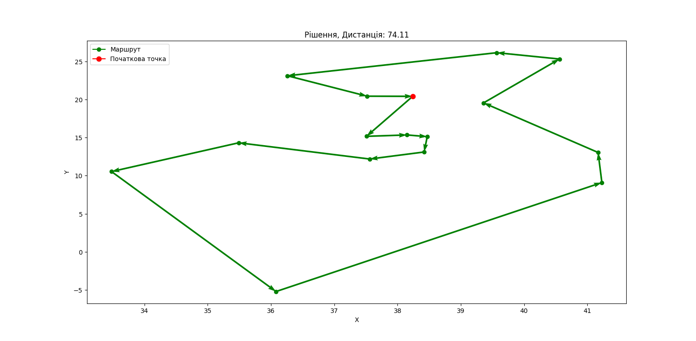
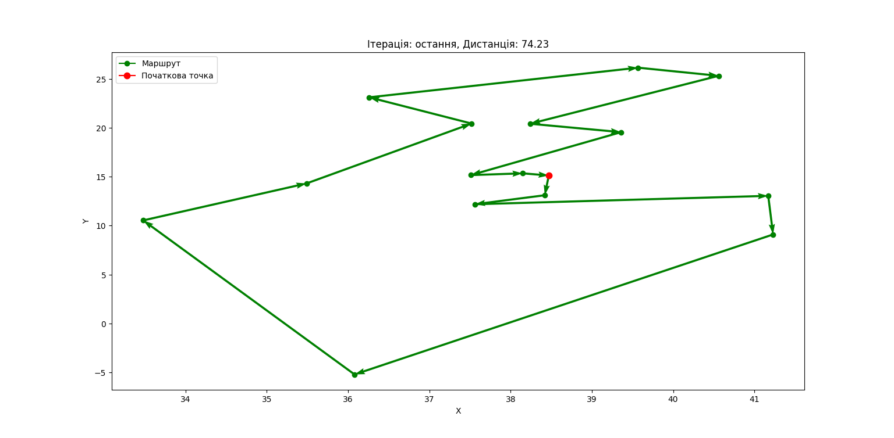
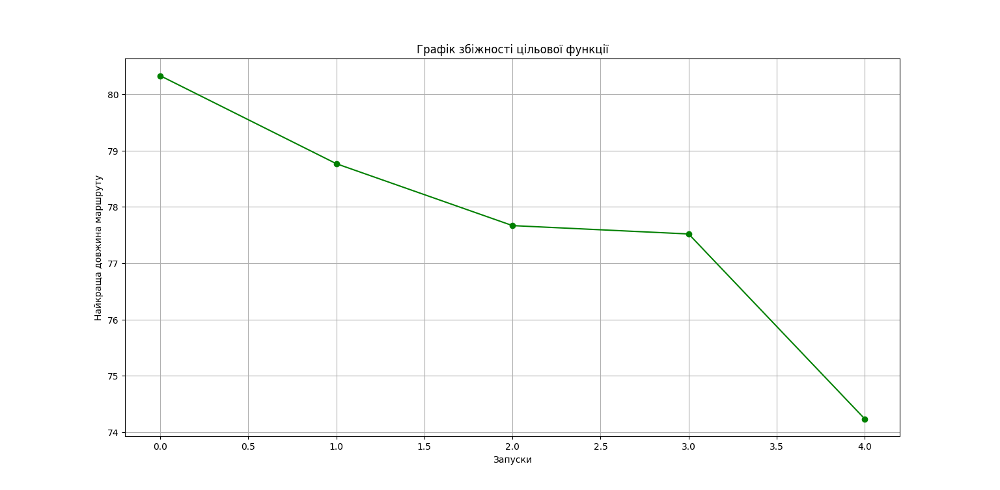

# heuristic_algorithms_lab_work
Lab work 1 for heuristic algorithms

[Path to input data](../../data/lab_2/input)

[Path to output data](../../data/lab_2/output)

[Main file](main.py)

Solution for dataset:

Result of Hill Climbing:

Histogram:

Convergence:

