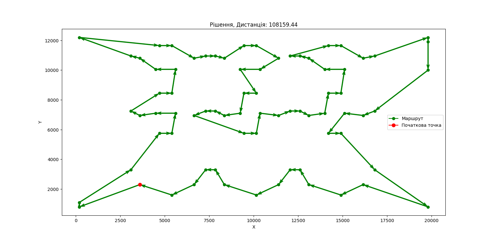
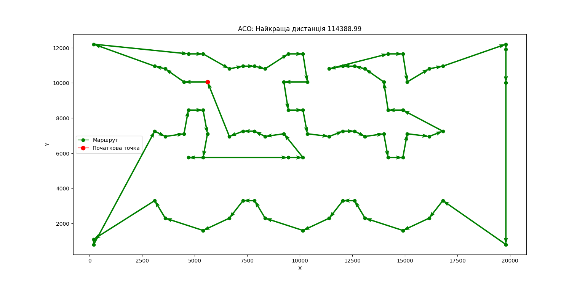
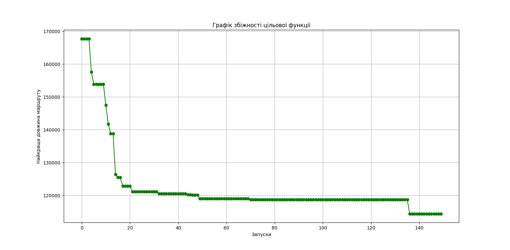

# heuristic_algorithms_lab_work
Lab work 3 for heuristic algorithms

[Path to input data](../../data/lab_3/input)

[Path to output data](../../data/lab_3/output)

[Main file](main.py)

Solution for dataset:

Result of ACO(Ant Colony Optimization):

Histogram:

Convergence:

